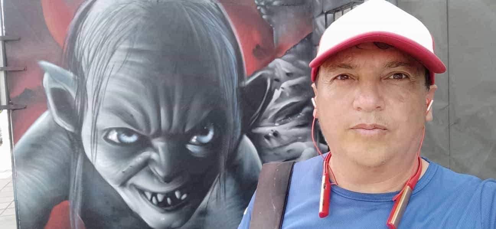

    <h1 align="center">Hola, soy  <a href="https://gitgenio.github.io/portafolio/">Cesar</a> 👋</h1>
    

    <h3>👨🏻‍💻 &nbsp;Sobre mí</h3>
    
📠&nbsp;Soy tecnico en Sistemas de SENA Colombia.  
        🌱 &nbsp;Me encanta adquirir conocimientos sobre avances tecnológicos, y constantemente busco enfrentarme a retos que me permitan crecer. 
        💼 &nbsp;Actualmente estoy trabajando en mi portafolio y en proyectos personales.  
        📚 &nbsp;En mi tiempo libre me gusta leer, practicar deportes, ver series y películas, y jugar videojuegos.  
    

---  Mis Proyectos   -----
<table>
    <tr>
        <td width="50%">
            <h3 align="center"> Portafolio </h3>
            

                
                  
                

                    <strong> PORTAFOLIO </strong> que muestra mis proyectos personales y profesionales, destacando habilidades en  <strong> programación </strong>, resolución de problemas y desarrollo de <strong> aplicaciones </strong>funcionales y creativas.
                

            

        </td>

        <td width="50%">
             
            <h3 align="center">Rock Paper Scissors</h3>
            

                
                         
               
                
 <strong>APLICACIÓN</strong>  web del Juego clásico Piedra, Papel o Tijera, construida con <strong> HTML, CSS y JavaScript. </strong>

            

</table>

 

 

    <a href="https://github.com/gitgenio">
        <!--  -->
        
    </a>

